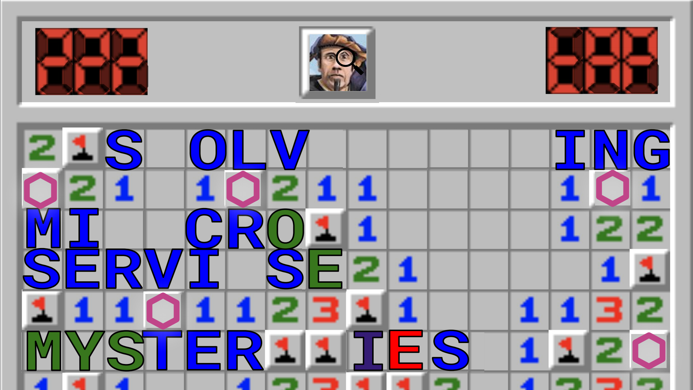
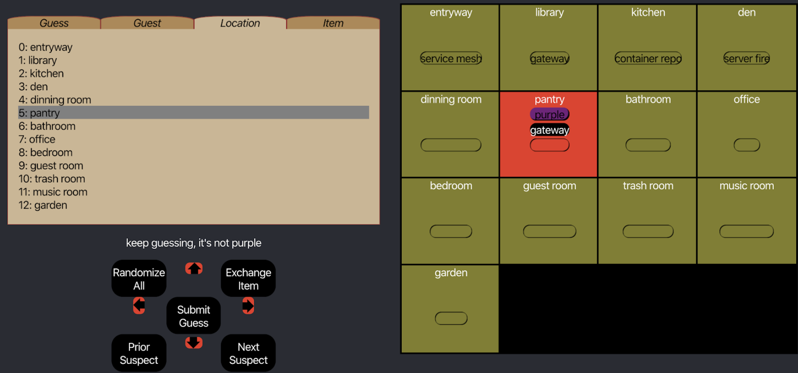

# Usage

- run the server
- post guesses
- solve the mystery!

## Start the server behind Envoy
```bash
go run main.go --port 9912
## separate terminal, set envoy to listen on port 9911:
envoy -c envoy_config.yaml
```

## Query the server
```bash
## make a guess
curl localhost:9911/guess -X POST -d '{"guess": {"guest": "m66"}}' -H "Content-Type: application/json"
{"Msg":"keep guessing, it's not m66"}

## find the "crime"
curl localhost:9911/guess -X POST -d '{"guess": {"guest": "a","room":"b","object":"c"}}' -H "Content-Type: application/json"
aaaaaaahhhhhhh!!!! 
```

# Inspecting the Taps

- review the body when encoded as bytes:

```bash
cat yesss_8973587579530408056.json | jq -r '.http_buffered_trace.request.body.as_bytes' | base64 -d
```

# Use the game interface

